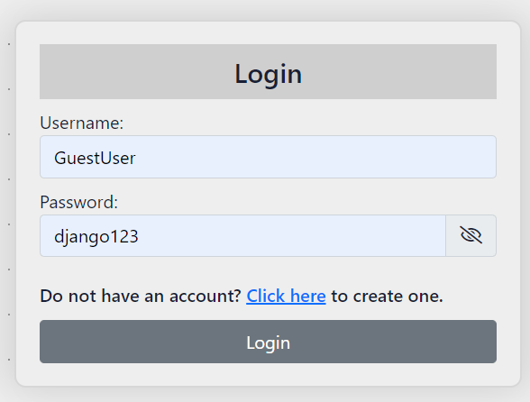
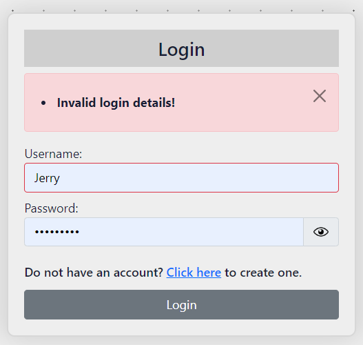
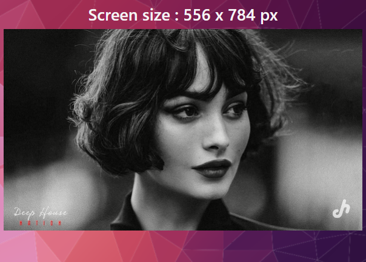
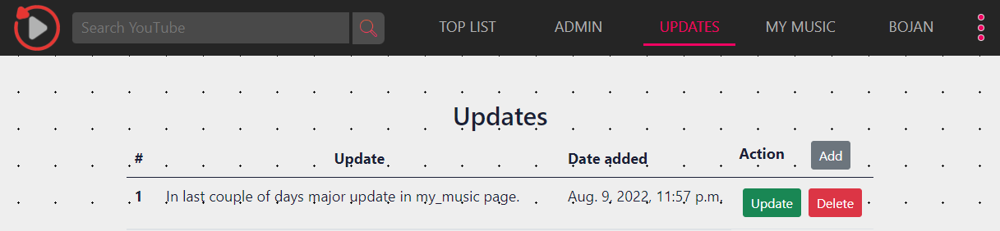
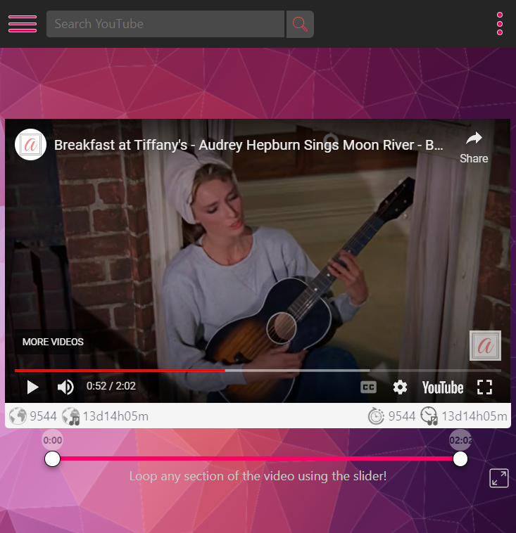
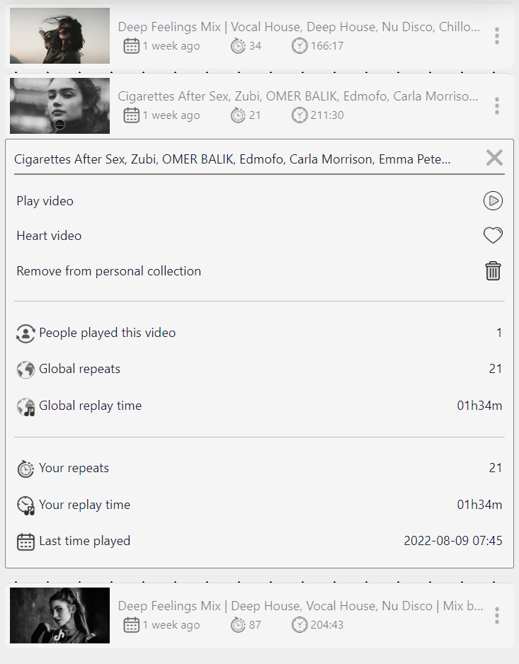
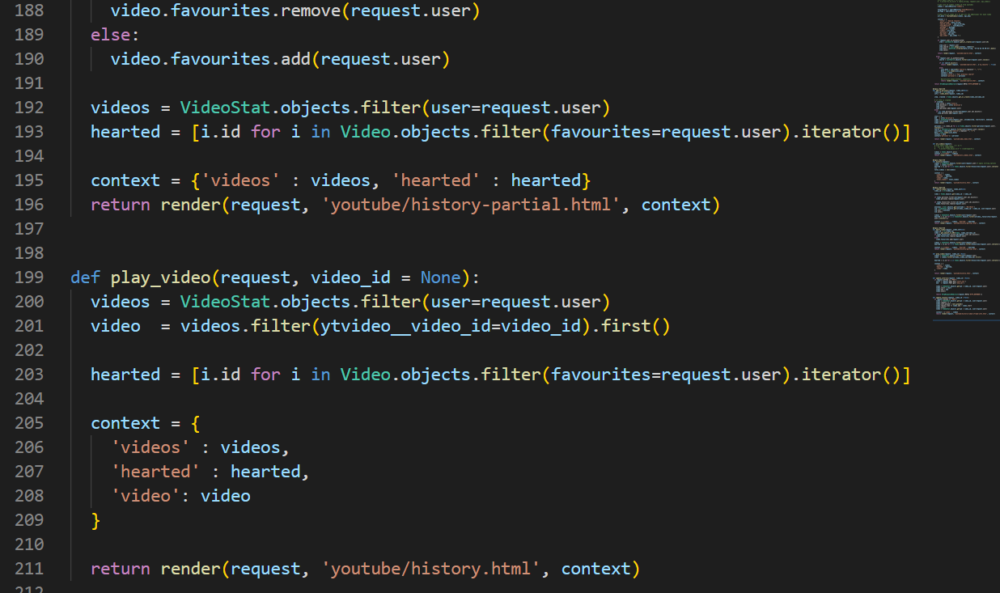
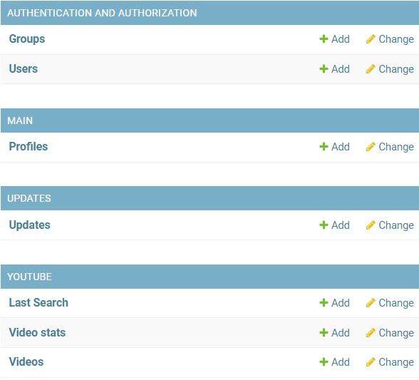

##### **Some of the projects I've been working on**

### **Music on repeat

Github: Private repository, still working on it when have spare time.
Hosting: https://bojan.pythonanywhere.com/

This is the most complex django app that I created so far. It has a lot of components. As a user you can search for a song (using youtube api), from a given search result you can add a song to your playlist and then play it on repeat mode. I built this for my personal user because when I listen some music I like to listen the same composition over and over again. The project is still in development even though the main components are finished. It is very popular, at least within my family.

There are several django apps within this project.

## **Main app**

This app handles all the python logic regarding user login, logout, creation of an account, having the base template for the whole project. I used just a tiny bit of bootstrap and build things mostly on my own using plain CSS.

# **Signup form**

Users can create an account and for passwords I'm using hashing algorithms so that the password is never stored as a plain text in the db. I also defined some password/username validations.

# **Login form:**

For the password show/hide button I wrote a short JS function that will basically toggle image src for those two icons.

After login, user is redirected to the index page. As you can see the index page still requires some work, but that is practically only some styling, nothing more.

## **Updates**

This app is only for my own use and I created it just to keep track of some updates. Whenever I add certain functionality to the project I would add an item in this part of the database. It is fully functional with complete CRUD operations and for this I've been leveraging AJAX with HTMX, no page refresh is needed.

## **YouTube app**

This is the major app of the project. It handles all the python logic and templates regarding the user experience.

Once user add a song/video to their playlist, they can play it, add it to the list of favorites, remove completely from the playlist.

Snippet of the My Music page.

The My Music page contains a list of videos that user has added to the playlist.

Snippet of the music list.

Code snippet.

Admin panel.

